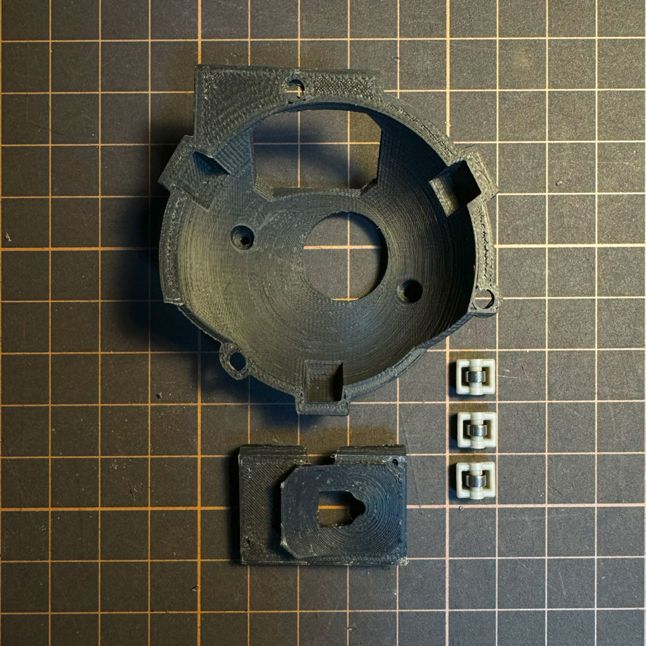
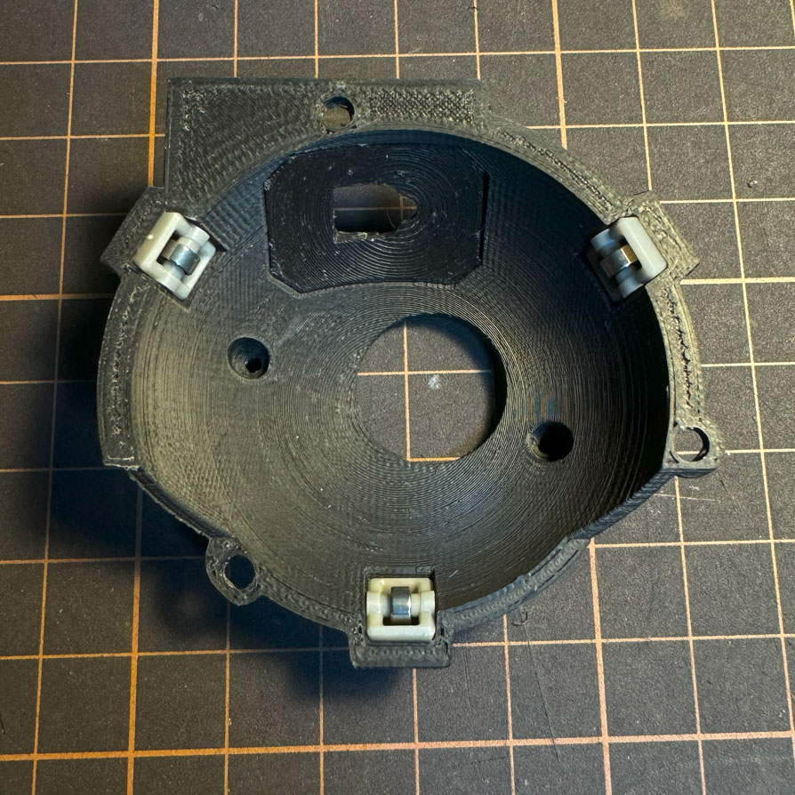
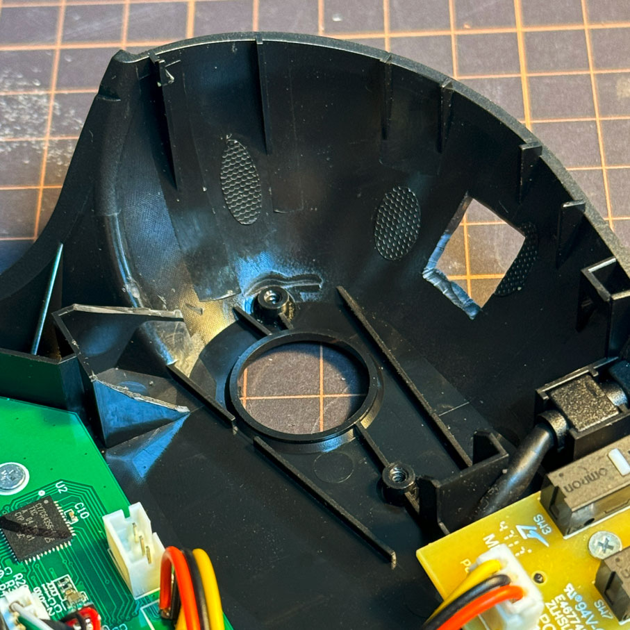
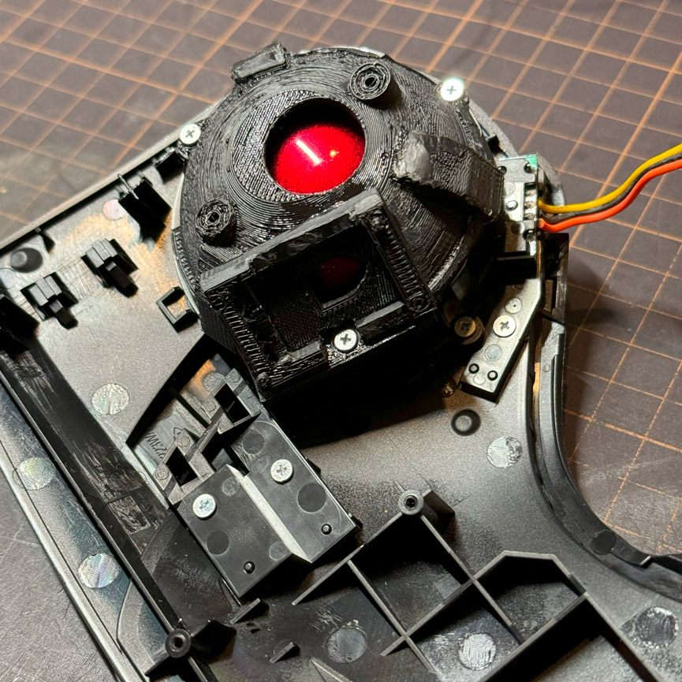

# HUGE_BU_MOD

エレコムHUGE用の人工ルビー支持球をベアリングユニットに置きかえるための3Dモデルを公開しています。
* HUGE_balltray_BU.stl :: ベアリングユニットを乗せるためのモデルです。
* HUGE_for_sensorPCB.stl :: センサー用のPCBを固定するためのモデルです。

二つのモデルを組み合わせて仕様します。 
 
 
ベアリングユニット取り付ける関係でアンダートレイを削って加工する必要があります。

 
トップケースの裏に取り付けた状態 
 

- ベアリングユニットはエレコムIST用のベアリングを想定しています。IST用の交換ベアリングユニット(M-BS10)は別途入手してください。
- 分解・改造を伴うため、製品の保証はなくなります。
- ベアリングユニット換装に伴い発生する事象についていかなる責任も負いかねるのですべて自己責任でお願いします。
 

a 3D model for replacing the artificial ruby-supported ball of the Elecom HUGEE with a bearing unit.

・The bearing unit is intended for use with Elecom IST bearings.
・Due to disassembly and modification, the product warranty will be void.
・Regarding any events that may occur during the replacement of the bearing unit, we cannot assume any responsibility, so please proceed at your own risk.
